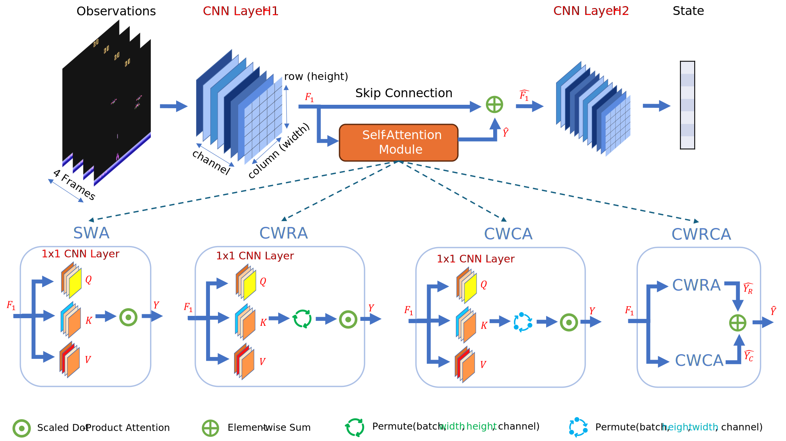
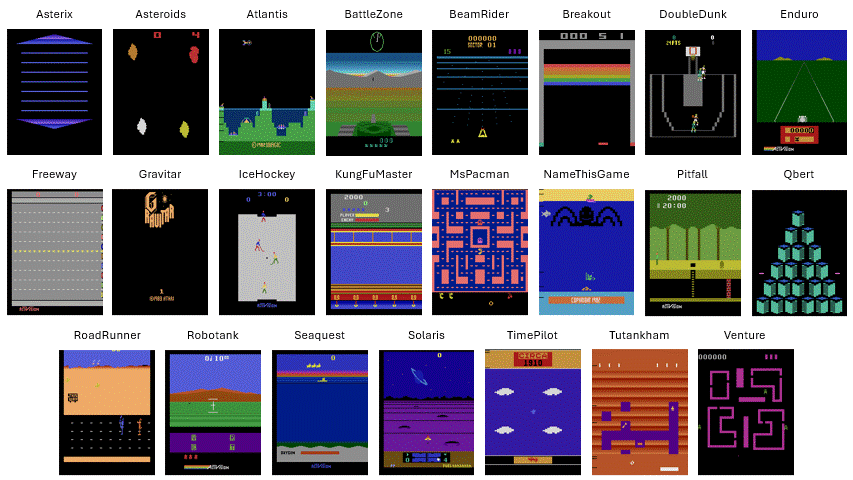
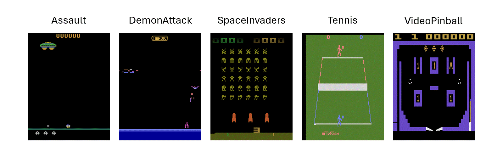
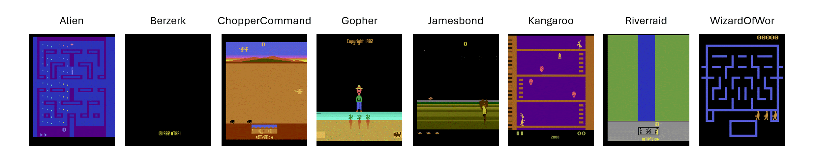
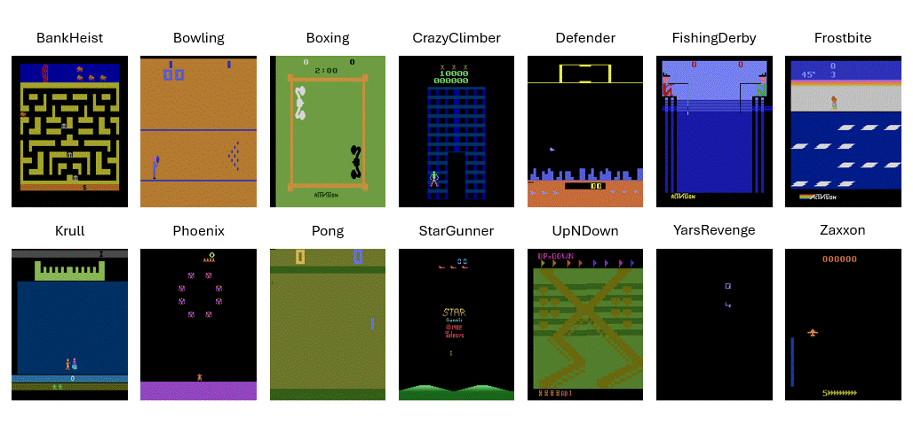
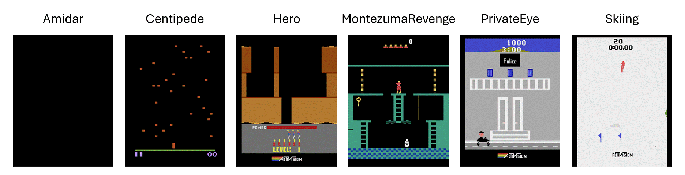
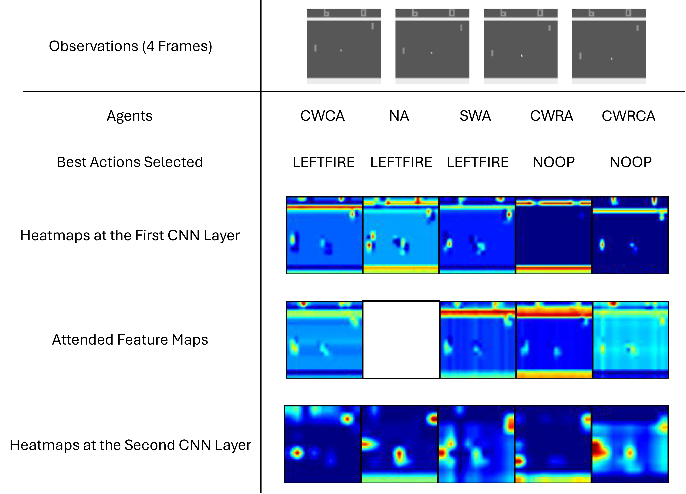

# Investigating Self-Attention: Its Impact on Sample Efficiency in Deep Reinforcement Learning (ICLR 2025)

## TL;DR

<div align='center'>
  Designs of self-attention modules
  
</div>

<br>

- We focus on investigating the underlying operation of the self-attention mechanism and its impact on sample efficiency by designing various self-attention modules and evaluating them with a baseline RL algorithm in the Arcade Learning Environment (ALE).
- Our key findings indicate that different self-attention modules affect the agent’s learning process differently, possibly due to the unique inductive bias of each self-attention module.
- We perform an interpretability study to provide better insights into how various self-attention modules influence sample efficiency through the lens of state representation and exploration.
- From our initial observations, we hypothesize that self-attention modules may generate artifacts that subtly influence the interplay between feature extraction, action selection, and reward collection.

[Paper](https://openreview.net/pdf?id=J5s6EG6ual)

**BibTex**

If you find this code or paper useful, please use the following reference:
```
@inproceedings{
anonymous2024investigating,
title={Investigating Self-Attention: Its Impact on Sample Efficiency in Deep Reinforcement Learning},
author={Anonymous},
booktitle={Submitted to The Thirteenth International Conference on Learning Representations},
year={2024},
url={https://openreview.net/forum?id=J5s6EG6ual},
note={under review}
}
```

## Setup

### System Info

- OS: Linux-5.15.0-33-generic-x86_64-with-glibc2.29
- Python: 3.8.5
- Stable-Baselines3: 2.0.0
- PyTorch: 1.13.0+rocm5.2 (Note: this code is tested on the [ROCm](https://github.com/ROCm/ROCm) compute platform. You may change it to PyTorch CUDA if you're using CUDA.)
- Numpy: 1.22.4
- Cloudpickle: 2.2.1
- Gymnasium: 0.28.1
- OpenAI Gym: 0.26.2

### Installation

- Create a virtual env
```bash
python -m venv venv
source venv/bin/activate
```
- Install PyTorch
```bash
pip install torch==1.13.0+rocm5.2 torchvision==0.14.0+rocm5.2 torchaudio==0.13.0 --extra-index-url https://download.pytorch.org/whl/rocm5.2
```
- Install other dependencies
```bash
pip install -r requirements.txt
```
- Create an IPython kernel for Jupyter Notebook
```bash
python -m ipykernel install --user --name=venv
```

## Training

Launch a training run
```bash
# activate the virtual env
source venv/bin/activate
# e.g., env=PongNoFrameskip-v4, self_attn='NA', seed=0
python -u src/train.py --algo ppo  --env PongNoFrameskip-v4 --tensorboard-log logs --eval-freq 200000 --eval-episodes 5 --save-freq 500000 --log-folder logs --seed 0 --vec-env subproc --uuid \
--hyperparams policy_kwargs:"dict(features_extractor_class=SelfAttnCNNPPO, features_extractor_kwargs=dict(self_attn='NA'), net_arch=[])"
```

Launch all training runs using [PBS Pro](https://altair.com/pbs-professional)
```bash
src/launch.sh
```

## Results & Analysis

All data and code used for experiment analysis can be found in the `results` folder.

### Evaluation

The evaluation data is saved as `data/post_processed_results_56.pkl` and the evaluation plots (i.e., the aggregate performance, sample efficiency, performance profiles, and the probability of improvement) can be reproduced using the `evaluation.ipynb`.

We also report performance per game and collate the games that are won by each agent to see if there is any correlation between the inductive biases of the agents and the game mechanics. 

<div align='center'>
  Games won by the PPO baseline
  
</div>

<br>

<div align='center'>
  Games won by the SWA agent
  
</div>

<br>

<div align='center'>
  Games won by the CWRA agent
  
</div>

<br>

<div align='center'>
  Games won by the CWCA agent
  
</div>

<br>

<div align='center'>
  Games won by the CWRCA agent
  
</div>

<br>

### Interpretability

The data used for the interpretability study are stored in the `gradcam` folder where the observations are saved as `.npy` files and the model checkpoints are saved as `.zip` archives. <br>
The plots from the section interpretability study can be reproduced using the `interpretability.ipynb`. <br>
Based on the attended feature maps, we hypothesize that self-attention modules may produce various artifacts that subtly influence agents' learning performances.

<div align='center'>
   
</div>

<br>

## Credits

- [PyTorch](https://github.com/pytorch/pytorch)
- [Stable Baselines3](https://github.com/DLR-RM/stable-baselines3)
- [RL Baselines3 Zoo](https://github.com/DLR-RM/rl-baselines3-zoo)
- [Gymnasium](https://gymnasium.farama.org/)
- [rliable](https://github.com/google-research/rliable)
- [pytorch-gradcam](https://github.com/vickyliin/gradcam_plus_plus-pytorch)


